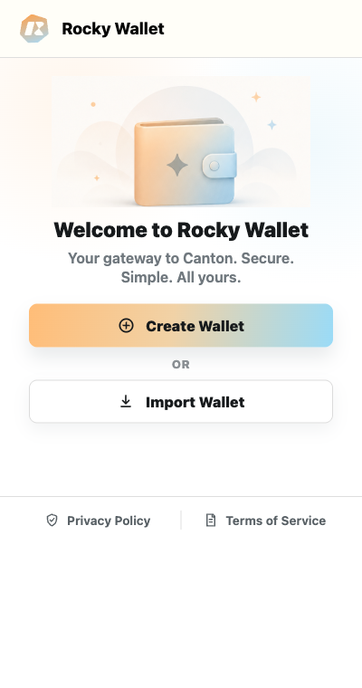

# Welcome to Rocky Wallet

Rocky Wallet is a self-custodial browser wallet for Canton Mainnet. It keeps wallet signing material inside the Extension while giving users a focused way to view assets, send and receive tokens, review Offers, and connect to Canton DApps.

*Rocky Wallet entry screen. Screenshots in this guide use demonstration data.*

## What you can do

- Create a Canton wallet or import an existing one.
- View configured Canton Coin and Token Standard assets.
- Send assets after reviewing the destination, amount, and fee.
- Receive assets manually through Offers, or enable registrar-wide receive preapproval.
- Review transaction history and manage remembered accounts and contacts.
- Connect DApps without sharing your private key or recovery phrase.

## Start here

1. [Install the Extension](getting-started/install-extension.md).
2. [Create a Wallet](getting-started/create-wallet.md) or [Import a Wallet](getting-started/import-wallet.md).
3. [Back Up Your Recovery Phrase](getting-started/backup-recovery-phrase.md).
4. [Connect Rocky Exchange](using-the-wallet/connect-rocky-exchange.md).
5. [Receive Assets](using-the-wallet/receive-assets.md) and [Send Assets](using-the-wallet/send-assets.md).
6. Review [Wallet Security](permissions-and-security/wallet-security.md).

## Documentation version

These docs describe Rocky Wallet Extension, Backend, and SDK version 1.0.2. Behavior may change, and the confirmation shown by your installed Extension is authoritative.

> Rocky Wallet is self-custodial. Rocky Exchange cannot recover a lost recovery phrase or private key.
