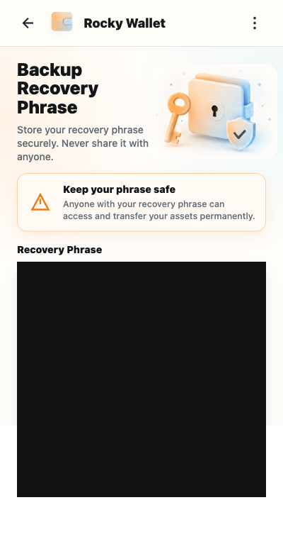

# Back Up Your Recovery Phrase

Your 12-word recovery phrase restores the signing material for a wallet created in Rocky Wallet. Rocky Wallet 1.0.2 also requires the complete Canton Party ID during import, so record both before adding funds.

*The recovery phrase is fully redacted. Never publish or send a real phrase.*

## Back up and verify the phrase

1. Write down all 12 words in the exact order shown by the Extension.
2. When prompted, enter the requested words to verify the backup.
3. Store the written phrase offline in a location you consider appropriate for sensitive records.
4. Copy and record the complete Party ID, including the fingerprint after `::`.
5. Confirm that every word, its position, and the complete Party ID are readable before funding the wallet.

During normal setup and startup, the Extension directs you to backup verification. DApp signing also remains gated behind the backup step until verification succeeds. Do not fund or use the wallet before completing the backup.

> **Security warning:** Rocky Exchange cannot recreate or recover your recovery phrase. Anyone who obtains it can control the wallet.

## Keep the backup available

Consider making a second handwritten copy and storing it separately, such as in another trusted location. Separate copies can reduce the risk of one accident destroying the only backup, but no storage location is guaranteed to be physically secure. Check the copies periodically for readability without photographing or digitizing them.

Next: [Receive Assets](../using-the-wallet/receive-assets.md)
