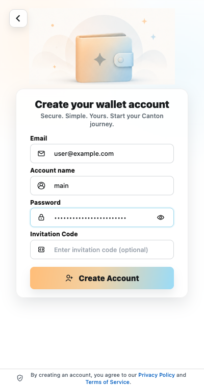

# Create a Wallet

Creating a wallet generates a new 12-word recovery phrase and stores the wallet in a locally encrypted vault.

*Use your own account information. The values in this screenshot are examples.*

## Before you begin

- Be ready to store the 12 recovery words securely and in their exact order.
- Choose a unique wallet/account password that you do not use for another account or service.
- Use an email inbox you can access for account registration and verification. Email cannot replace the recovery phrase or recover the wallet by itself.

## Create your wallet

1. Open the Rocky Wallet Extension.
2. Select **Create Wallet**.
3. Enter your email and an account name. Account names use 3-32 letters, numbers, underscores, or hyphens.
4. Enter a unique wallet/account password of at least 8 characters.
5. Enter an invitation code only when you received one through an official Rocky channel.
6. If the Extension requests email verification, enter the 6-digit code only inside Rocky Wallet.
7. Select **Create Account**.
8. Record the generated 12-word recovery phrase in its exact order.
9. Complete the recovery phrase verification when prompted.
10. Complete the backup before funding or using the wallet.

During normal setup and startup, the Extension directs you to backup verification. DApp signing also remains gated behind the backup step until verification succeeds. Do not fund or use the wallet before completing the backup.

Your wallet/account password protects the encrypted local vault and is also used for Rocky account registration and authentication. It never replaces the recovery phrase, and it is not the Canton signing key.

> **Security warning:** Do not take a screenshot of the recovery phrase or save it in cloud notes, chat, or email. Anyone with the phrase can control the wallet.

## If setup does not complete

- **Recovery phrase verification mismatch:** compare each requested word with the phrase you recorded, including its position, and try again.
- **Interrupted setup:** reopen the Extension and follow the setup state it displays. Do not reset or remove the Extension unless you have a verified recovery phrase backup; otherwise, you may lose access to the wallet.

Next: [Back Up Your Recovery Phrase](backup-recovery-phrase.md)
