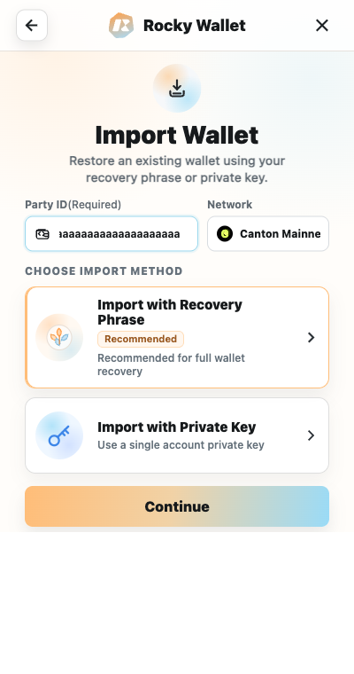
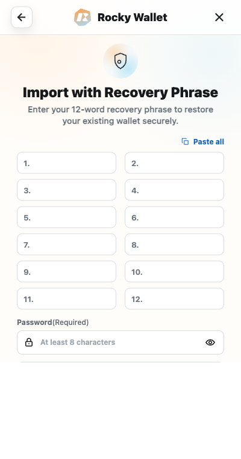

# Import a Wallet

Use **Import Wallet** to restore an existing wallet in the Rocky Wallet Extension. You can import with either of these secrets:

- **Import with Recovery Phrase:** the wallet's 12 recovery words in their original order.
- **Import with Private Key:** the private key associated with the wallet account.

Before importing, confirm that the recovery phrase or private key controls the Canton party you intend to restore. Obtain the complete Canton Party ID from the existing wallet or its provider, and verify the full `name::fingerprint` value rather than a shortened display. Importing a valid but different secret can open a different party.

## Import your wallet

1. Open the Rocky Wallet Extension and select **Import Wallet**.
2. Enter the complete Canton Party ID and verify the full `name::fingerprint` value.
3. Select **Import with Recovery Phrase** or **Import with Private Key**.
4. Select **Continue**.
5. On the next screen, enter the corresponding recovery phrase or private key only inside the Rocky Wallet Extension.
6. Enter the wallet/account password in the single password field.
7. Submit the import and wait for the account and network state to load.

*The screenshot contains placeholders only. Never capture or publish a real recovery phrase.*

> **Security warning:** A website, support representative, or DApp must never request your recovery phrase or private key. Do not enter either secret outside the Rocky Wallet Extension.

## If import does not complete

- **Invalid word count:** make sure the recovery phrase contains all 12 words, separated by spaces and in the original order.
- **Invalid key format:** copy the complete private key without extra spaces or missing characters.
- **Party or key mismatch:** stop and verify that the phrase or key belongs to the Canton party you expect. Never send the secret to another person for checking.

Next: [Home and Assets](../using-the-wallet/home-and-assets.md)
