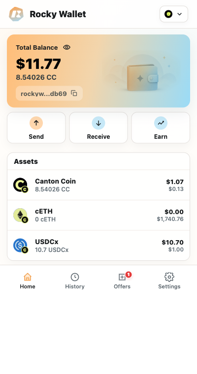

# Home and Assets

Home is the starting point for checking the selected account, viewing assets, and opening everyday wallet actions.

*Balances and shortened addresses shown in screenshots are demonstration data.*

## Read the balance card

- **Total Balance** is the estimated USD total for assets that have an available price quote. It is not a ledger balance by itself; use the quantity beside each asset to see how many tokens the account holds.
- The address below the balance identifies the selected Canton party. A complete Party ID has the form `<party-name>::<fingerprint>`. A fingerprint commonly begins with `1220`.
- To keep the Home card readable, Rocky Wallet preserves the party name and shortens only the fingerprint, for example `party-name::1220...last4`. Select the copy control to copy the complete Party ID, not the shortened label.

> **Price note:** A displayed `$0.00` can mean that Rocky Wallet does not currently have a price quote. It is not proof that the token quantity is zero or that the asset has no value.

## Use the Home actions

- **Send** opens the asset picker and transfer workflow.
- **Receive** shows the selected account's full Party ID and QR code.
- **Assets** lists configured assets, their ledger quantities, and available USD estimates. Select a sendable asset to start a transfer with that asset selected.
- **History** shows received assets, outgoing transfers, transfer-fee legs, and failed incoming records reported for the selected account.
- **Offers** shows incoming transfers that require a decision. Its badge counts pending, unexpired offers.
- **Settings** contains the account selector, Address Book, security controls, network information, language, and Extension version.

## Understand asset labels

Rocky Wallet keeps a normal ledger symbol such as `CC`, `CBTC`, or `USDCx` beside a quantity. If a Token Standard ledger symbol is instead the raw instrument ID, the Extension uses the configured display alias for the quantity label. A descriptive alias does not replace a normal symbol.

This distinction helps preserve the ledger-provided symbol while making instrument-ID-shaped labels readable. The asset must still have an exact configured identity before it becomes actionable.

## Refresh the current wallet view

From the top of any bottom-navigation page - **Home**, **History**, **Offers**, or **Settings** - pull down and release to refresh the current wallet view. Wait for the refresh indicator to finish before evaluating the result.

A refresh requests the data needed by the current view. Network or service failures can leave the previous snapshot on screen and show an error, so a gesture does not guarantee that every requested data source succeeded. If the result remains uncertain, compare the relevant transaction or offer with the ledger-facing record.

Next: [Supported Assets](../supported-assets.md)
