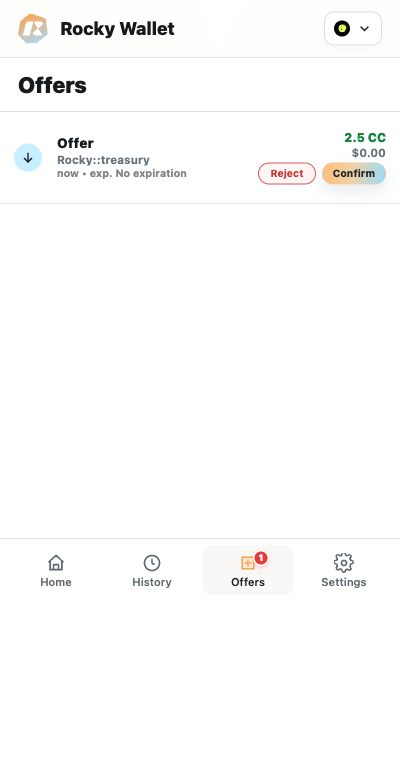

# Offers

Offers are incoming transfers that may require a wallet decision before receipt completes. The Offers badge counts pending offers that have not expired.

*Sender, amount, and status values in screenshots are demonstration data.*

## Understand offer status

- **Pending:** the offer is still within its decision window and can have available actions.
- **Expired:** if a loaded offer passes its expiration time, Rocky Wallet marks it expired locally, removes its actions, and excludes it from the pending badge. The Offers API returns only **Pending** offers, so the offer may disappear after a refresh once the backend marks it **Expired**.
- **Accepted:** you authorized acceptance. The offer may leave the active list after refresh; confirm the completed receipt in **History** or the ledger result.
- **Rejected:** you declined the offer. Do not expect the offered quantity to be added to the wallet.
- **Failed:** acceptance or the incoming transfer did not complete. A related **Received failed** row can appear in **History** when that result is reported.

## Review and decide

1. Open **Offers** from the bottom navigation.
2. Select an offer to inspect its sender, exact asset label and symbol, amount, creation time, expiration, and offer ID when those fields are provided.
3. Verify the sender's complete Party ID with the copy control. Do not rely on a shortened address or familiar-looking party-name prefix.
4. Select **Accept** only if you recognize the sender, expect the transfer, and trust the exact configured asset identity. Select **Reject** if the offer is valid and actionable but unwanted.
5. Enter the account password or authenticate if Rocky Wallet asks you to unlock before it signs the decision.
6. Refresh **Offers** and **History**, then verify the ledger result.

Accept or reject an offer only through the Rocky Wallet Extension UI. A website or DApp cannot silently make this decision for you.

> **Security note:** An unknown sender can remain visible, so you must decide whether to trust the complete Party ID. An unconfigured asset can also remain visible, but the Extension does not enable acceptance until the asset's exact identity is configured, enabled, and eligible. A display name, symbol, logo, or local label alone is not identity proof. Actions can also be unavailable after expiry.

## Receive preapproval and existing offers

Enabling receive preapproval does not accept or alter offers that are already pending. Those offers remain manual and still require **Accept** before they expire. Preapproval applies only to qualifying future transfers within its configured registrar scope.

If an action fails because an offer expired or is no longer available, refresh the list before trying anything else. Never infer receipt from a button press alone.

Next: [Receive Preapproval](../permissions-and-security/receive-preapproval.md)
