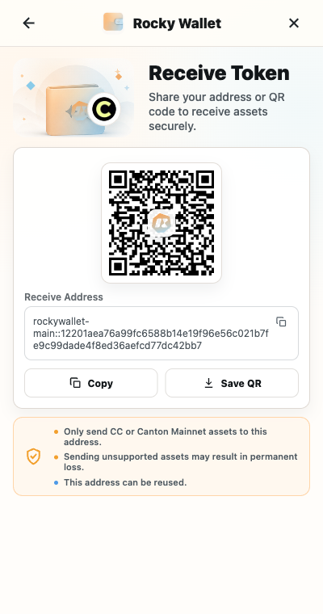

# Receive Assets

Receiving starts with the complete Canton Party ID for the selected account. The QR code and copy action on the Receive screen use that full ID.

## Share your receiving Party ID

1. Confirm that the intended account is selected and unlocked.
2. From **Home**, select **Receive**.
3. If the screen includes an asset selector, select the supported asset you expect to receive.
4. Select **Copy** to copy the complete Party ID, or let the sender scan the QR code.
5. Share the exact copied ID with the sender. Ask them to compare the complete `party-name::fingerprint` value before sending.
6. After the sender submits the transfer, refresh **Home** and **Offers** to check for the resulting balance, history entry, or pending offer.

Home may display an address such as `party-name::1220...last4`, but its copy control returns the complete Party ID. The Receive screen shows and copies the complete value. Never type the omitted fingerprint characters by hand from a shortened label.

*Example only. Do not send assets to an address or QR code copied from documentation.*

> **Asset warning:** Share the Party ID only for an asset supported by Rocky Wallet on the selected network. An unsupported or unconfigured asset may not be actionable or may not appear as expected. Verify the asset's exact identity with the sender before they transfer it.

## Direct receipts and Offers

A manual incoming Token Standard transfer can appear in [Offers](offers.md) and require **Accept** before receipt completes. If receive preapproval is enabled for a matching configured registrar, a future matching transfer can arrive directly instead.

Receive preapproval is not retroactive: an offer that is already pending still needs a manual decision. Coverage also depends on the currently configured registrar scope, so do not assume that enabling it makes every asset or sender eligible. See [Receive Preapproval](../permissions-and-security/receive-preapproval.md) for the scope and confirmation flow.

## If nothing appears

- Confirm that the sender used the complete Party ID for the currently selected account.
- Check **Offers** as well as the Home balance and **History**.
- Pull down from the top of the current bottom-navigation page to refresh it.
- Ask the sender for the ledger result or update identifier. A QR scan or copied address proves only the destination supplied; it does not prove that a transfer was submitted or completed.

Next: [Offers](offers.md)
