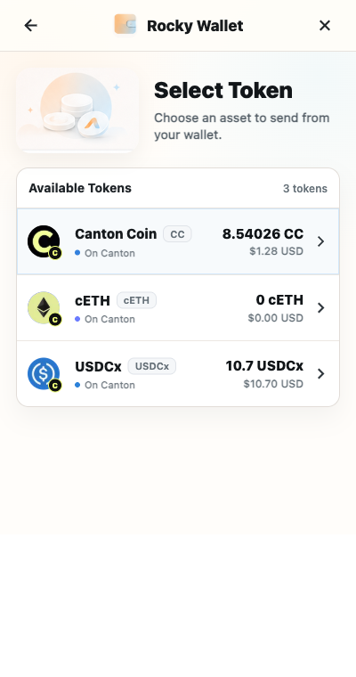
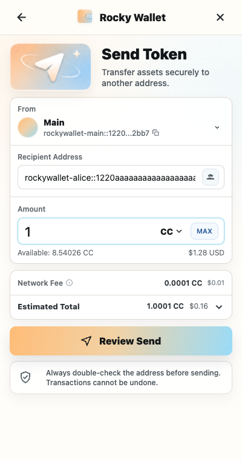
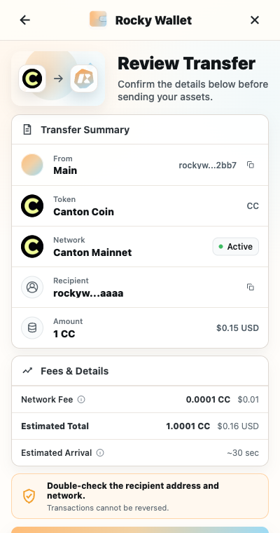

# Send Assets

Rocky Wallet prepares a transfer for the asset and recipient you choose, shows the fee and total before approval, and signs only after you confirm.

## Before you send

Confirm all of the following:

- The selected account is unlocked.
- The asset is configured, enabled, and available to send.
- You have the recipient's exact, complete Canton Party ID, or a contact whose complete Party ID you have independently verified.
- The account has enough of the asset for the amount and enough `CC` for the displayed fee. When sending `CC`, the amount and fee can draw from the same balance.

For a new recipient, send a small test amount first and verify that it reached the intended party before sending more.

## Send a transfer

1. From **Home**, select **Send**.
2. Select the asset to send. Assets that are not configured, enabled, or sendable cannot be selected.
3. Paste the recipient's complete Party ID into **Recipient Address**, or choose a verified entry from the Address Book.
4. Enter the amount. Check **Available**, and remember that **MAX** must leave room when the fee uses the same asset.
5. Select **Review Send**.
6. On the review screen, verify the destination, asset, amount, network fee, and estimated total debit. If the fee is in a different asset, verify both the transfer amount and the separate fee amount.
7. Select **Confirm Send** only if every value is correct.
8. Enter the account password or complete authentication if the Extension asks you to unlock or reauthenticate.
9. Wait for the success screen, then review **History** after the ledger update is available.

> **Security note:** One confirmation can authorize the prepared asset transfer together with the displayed fee leg or legs. Rocky Wallet signs those prepared transactions with keys held locally by the Extension. Confirmation does not send the recovery phrase or private key to the recipient or DApp.

## Screen examples

*Select only a configured, enabled asset with sufficient available balance.*

*The recipient and values shown are demonstration data.*

*Review every displayed value before selecting Confirm Send.*

## If the transfer does not complete

- **Insufficient asset balance:** reduce the amount and account for a fee charged in the same asset.
- **Insufficient `CC` for the fee:** add enough `CC` to the selected account, even when sending another asset.
- **Unsupported or unconfigured asset:** return to the asset picker and use an asset that is configured, enabled, and sendable.
- **Invalid Party ID:** obtain the complete ID again and check the full `party-name::fingerprint` value. Do not reconstruct it from a shortened label.
- **Expired preparation:** return to the send form, review current balances and fees, and prepare the transfer again.
- **Rejected confirmation or authentication:** no transfer should be assumed. Review the status shown by the Extension and start again only if you still intend to send.

If the Extension reports success but the expected row is not yet visible, refresh **History**. Treat the ledger result, rather than a cached USD estimate, as authoritative.

Next: [Transaction History](transaction-history.md)
